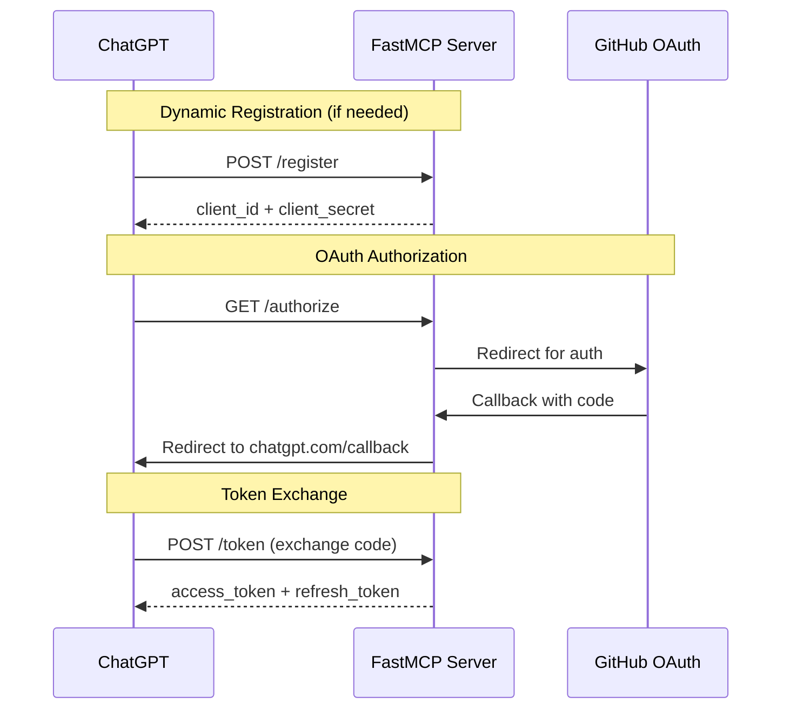

# ChatGPT OAuth Setup Guide

This guide explains how to configure ChatGPT GPT Actions to authenticate with the Hansard MCP Server using OAuth 2.0 with dynamic client registration.

## Overview

The Hansard MCP Server uses FastMCP's OAuth proxy with GitHub authentication. ChatGPT clients can dynamically register themselves and obtain credentials on the fly.

**Current Configuration**:
- **OAuth Provider**: GitHub OAuth (via FastMCP proxy)
- **Dynamic Registration**: Enabled via `/register` endpoint
- **Client Storage**: Disk-based (persists across restarts within same Cloud Run instance)
- **Authorization Endpoint**: `https://mcp.simonkennedymp.com.au/authorize`
- **Token Endpoint**: `https://mcp.simonkennedymp.com.au/token`
- **Registration Endpoint**: `https://mcp.simonkennedymp.com.au/register`

## Client ID Issue (Resolved)

**Problem**: ChatGPT was receiving "Client Not Registered" errors for client ID `6b43cffe-4068-41d8-8e0b-6eefe67d34bd`.

**Root Cause**: The server was using in-memory storage (`MemoryKVStorage`), so registered clients were lost when Cloud Run restarted.

**Solution**: Switched to disk-based storage (FastMCP default), which persists OAuth client registrations across restarts.

**Status**: ✅ Fixed as of revision `hansard-mcp-server-00110-xxx` (deployed 2025-11-06)

## ChatGPT GPT Action Configuration

### Option 1: Manual Client Registration (Recommended)

If you want to use a fixed client ID (avoiding dynamic registration on every ChatGPT reconnect):

**Step 1: Register a client for ChatGPT**

```bash
curl -X POST "https://mcp.simonkennedymp.com.au/register" \
  -H "Content-Type: application/json" \
  -d '{
    "client_name": "ChatGPT Hansard Search",
    "redirect_uris": ["https://chatgpt.com/connector_platform_oauth_redirect"]
  }'
```

**Response** (save these credentials):
```json
{
  "client_id": "xxxxxxxx-xxxx-xxxx-xxxx-xxxxxxxxxxxx",
  "client_secret": "xxxxxxxxxxxxxxxxxxxxxxxxxxxxxxxx",
  "redirect_uris": ["https://chatgpt.com/connector_platform_oauth_redirect"],
  ...
}
```

**Step 2: Configure in ChatGPT GPT**

1. Go to your GPT settings → **Authentication**
2. Select **OAuth**
3. Set:
   - **Client ID**: (from step 1 response)
   - **Client Secret**: (from step 1 response)
   - **Authorization URL**: `https://mcp.simonkennedymp.com.au/authorize`
   - **Token URL**: `https://mcp.simonkennedymp.com.au/token`
   - **Scope**: `user` (or leave blank)

### Option 2: Dynamic Registration (Automatic)

ChatGPT can automatically register itself using the `/register` endpoint.

**Note**: This is what's currently happening with client ID `6b43cffe-4068-41d8-8e0b-6eefe67d34bd`. With disk-based storage now enabled, this client should persist across restarts.

## OAuth Flow



## User Authentication Flow

When a ChatGPT user tries to use the Hansard Search GPT:

1. **First-time setup**: ChatGPT redirects to `/authorize`
2. **Consent screen**: User sees FastMCP consent page asking to approve the ChatGPT client
3. **GitHub login**: User is redirected to GitHub for authentication
4. **Grant access**: User approves the GitHub OAuth app
5. **Return to ChatGPT**: User is redirected back to ChatGPT with authorization
6. **Token exchange**: ChatGPT exchanges the code for tokens
7. **MCP access**: ChatGPT can now call MCP tools with the access token

## Storage Persistence

**Current Setup** (as of 2025-11-06):
- **Storage Type**: Disk-based (FastMCP default)
- **Location**: Cloud Run ephemeral filesystem
- **Persistence**: Survives restarts within same instance
- **Limitation**: Lost if Cloud Run scales to new instance or migrates

**Future Improvements** (if needed):
- **PostgreSQL storage**: For multi-instance persistence
- **Redis storage**: For distributed deployments
- **Encrypted storage**: For enhanced security

## Troubleshooting

### Error: "Client Not Registered"

**Symptom**: ChatGPT shows "Client Not Registered" error for client ID `6b43cffe-4068-41d8-8e0b-6eefe67d34bd`.

**Cause**: OAuth client was registered but lost due to server restart (before disk storage fix).

**Solution**:
1. ✅ Fixed as of 2025-11-06 - disk storage now enabled
2. If error persists, ChatGPT will automatically re-register on next attempt
3. Check logs: `gcloud logging read 'resource.labels.service_name=hansard-mcp-server AND textPayload=~"Client registered"'`

### Error: "Unregistered client_id"

**Symptom**: Logs show "Unregistered client\_id=6b43cffe-4068-41d8-8e0b-6eefe67d34bd"

**Cause**: Client attempted authorization before registering.

**Solution**: ChatGPT should call `/register` first. This happens automatically in the OAuth flow.

### Checking Registered Clients

To see what clients are currently registered:

```bash
# Check server logs for registration events
gcloud logging read 'resource.labels.service_name=hansard-mcp-server AND textPayload=~"Client registered"' --limit 20
```

**Expected output**:
```
Client registered with redirect_uri: https://chatgpt.com/connector_platform_oauth_redirect
```

## Security Considerations

### Confused Deputy Attacks

FastMCP OAuth proxy includes consent screen protection:
- Users see client details before authorization
- Consent choices are remembered via signed cookies
- Prevents malicious clients from impersonating users

**Consent Screen Shows**:
- Client name: "ChatGPT Hansard Search"
- Redirect URI: `https://chatgpt.com/connector_platform_oauth_redirect`
- Requested scopes: `user`

Users must explicitly approve before ChatGPT can access the MCP server.

### Token Security

- **Storage**: Encrypted on disk using Fernet (AES-128-CBC + HMAC-SHA256)
- **JWT Signing**: HS256 with key derived from GitHub OAuth client secret
- **PKCE**: Enabled (Proof Key for Code Exchange)
- **Token Lifetime**: Matches GitHub OAuth token lifetime

## Testing

### 1. Test Registration Endpoint

```bash
curl -X POST "https://mcp.simonkennedymp.com.au/register" \
  -H "Content-Type: application/json" \
  -d '{
    "client_name": "Test Client",
    "redirect_uris": ["https://example.com/callback"]
  }'
```

**Expected**: Returns `client_id` and `client_secret`

### 2. Test Authorization Endpoint

```bash
# Visit in browser:
https://mcp.simonkennedymp.com.au/authorize?client_id=<CLIENT_ID>&redirect_uri=https://example.com/callback&response_type=code&scope=user
```

**Expected**: Redirects to GitHub login

### 3. Check OAuth Metadata

```bash
curl -s "https://mcp.simonkennedymp.com.au/.well-known/oauth-authorization-server" | jq
```

**Expected**:
```json
{
  "issuer": "https://mcp.simonkennedymp.com.au/",
  "authorization_endpoint": "https://mcp.simonkennedymp.com.au/authorize",
  "token_endpoint": "https://mcp.simonkennedymp.com.au/token",
  "registration_endpoint": "https://mcp.simonkennedymp.com.au/register",
  ...
}
```

## References

- **FastMCP OAuth Proxy Documentation**: https://docs.fastmcp.com/servers/auth/oauth-proxy
- **MCP Security Best Practices**: https://modelcontextprotocol.io/specification/2025-06-18/basic/security_best_practices
- **GitHub OAuth App Settings**: https://github.com/settings/developers (for upstream credentials)

## Change Log

- **2025-11-06**: Switched from MemoryKVStorage to disk-based storage to fix "Client Not Registered" errors
- **2025-11-06**: Initial ChatGPT OAuth setup documentation
